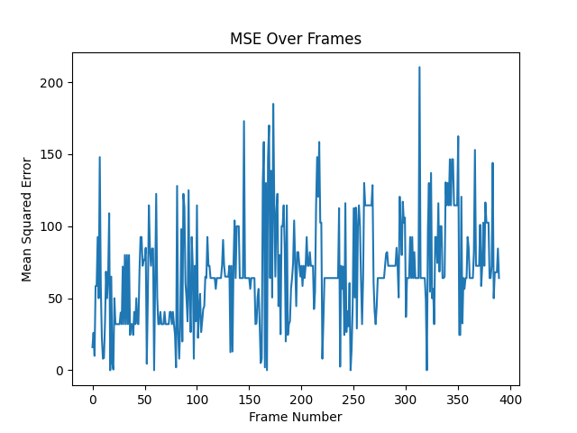

Sure, here's how your revised document would look like:

## Comparison of Full Search and Number of Non-Matching Points Algorithms for Motion Estimation in Video Processing

### Abstract
In the field of video processing, accurate motion estimation is a pivotal component. This document presents a comparative study of two algorithms used for this purpose - the Full Search algorithm and the Number of Non-Matching Points (NNMP) algorithm. The study utilizes a self-designed simulation where both algorithms are implemented and then analyzed based on Mean Squared Error (MSE), time efficiency, and magnitude of motion. The results reveal a substantial time advantage of NNMP over Full Search, albeit with a variance in MSE across the two algorithms.

### Introduction
Motion estimation forms a cornerstone of various video processing applications such as video compression, video stabilization, object tracking, and computer vision. It involves the determination of motion vectors that describe the transformation from one 2D image to another; usually from adjacent frames in a video sequence. This paper focuses on two prevalent algorithms, Full Search and Number of Non-Matching Points (NNMP), assessing their performance under a controlled simulation.

### Methodology

#### Simulation Setup
The simulation was structured around a specific video file, with frames captured and converted to grayscale for simplicity. Full Search and NNMP algorithms were subsequently applied to the frames to estimate motion vectors. Key metrics such as the time taken by each algorithm, the motion vectors, and the magnitude of motion were meticulously recorded.

#### Evaluation Metrics
The primary evaluation metrics for the study included:
- Mean Squared Error (MSE): Utilized as an accuracy measurement for comparing the results of the two algorithms.
- Time Performance: The time taken by each algorithm to estimate motion vectors.
- Magnitude of Motion: This helped in understanding the amount and direction of motion detected by the algorithms.

### Results

#### Time Performance
The results pointed to a significant time advantage for the NNMP algorithm over Full Search, with NNMP consistently performing faster across all frames.

Figure 1: Time Difference Over Frames

#### Accuracy of Motion Estimation
On comparing the motion vectors produced by both methods, a variance was observed as indicated by the MSE values. The differences in accuracy between the two methods varied per frame.

Figure 2: MSE Over Frames

#### Magnitude of Motion
Analysis of the magnitudes of motion indicated a varied distribution of motion estimation between both algorithms.

Figure 3: Magnitude of Motion Over Time

Average magnitude of motion: {insert value here}  
Total magnitude of motion: {insert value here}

#### Direction of Motion
Further analysis on the direction of motion was conducted.

Figure 4: Direction of Motion

### Discussion
The observed time efficiency of NNMP can be attributed to its approach of computing a score for each possible motion vector and updating the best motion vector, compared to Full Search's exhaustive search method. Despite the time advantage of NNMP, the varying MSE values suggest a potential trade-off between time efficiency and accuracy of motion estimation.

### Conclusion
The findings underscore the importance of understanding the specific requirements of any given task. While NNMP offers significant time efficiency, the selection between Full Search and NNMP should consider the acceptable trade-offs in terms of motion estimation accuracy.

### References
This section will include references to the foundational works or other relevant studies, if any, that have been referred to in this document.